# GD32V-RISC-V物联网操作系统TencentOS-Tiny案例实践指南

| Revision | Date      | Description |
| -------- | --------- | ----------- |
| 2.0      | 2021-12-20 | GD32V-RISC-V物联网操作系统TencentOS-Tiny案例实践指南    |

## 一、定制开发板EVB_LX硬件简介

### 1.1 开发板简介

EVB_LX+是腾讯物联网操作系统TencentOS tiny 团队联合兆易创新（GD32）、南京厚德物联网有限公司三方合作设计的一款物联网评估板，用于TencentOS tiny 基础内核、RISC-V新IP核架构和IoT组件功能体验和评估。
开发板功能图如下所示：

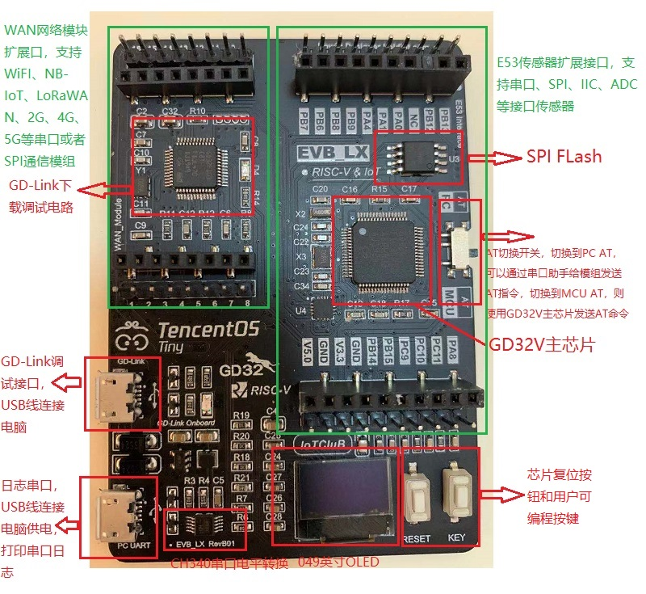


### 1.2 开发板特性
**CPU** ：GD32VF103RBT6, 108MHz，128K Flash，32KB SRAM

**显示屏** ：OLED，64*32分辨率

**电源特性** ：Micro USB接口，5V供电，内部有5V转3.3V的DCDC，MCU供电电压为3.3V，系统IO电压也为3.3V

**按键** ：一个复位按键，一个功能按键

**外部扩展存储** ：SPI FLASH

**LED指示灯** ：上电指示 LED，红色；一个用户定义LED，蓝色

**调试接口** ：板载GD-Link下载调试器，UART2串口连接PC

**XTAL** ：8MHz，32.768KHz

**传感器扩展接口E53 Interface** ：支持E53传感器案例扩展板（支持UART、SPI、IIC、GPIO、ADC、DAC等）

**网络模块扩展接口WAN Interface** ：支持多种无线通信模组扩展（UART&SPI&GPIO）

**操作系统支持** ：TencentOS tiny


### 1.3 开发板硬件详解

#### 1.3.1 电源电路
* 电源稳压电路
外部USB输入电压一般为5V，但这并不能直接作为电源给EVB_LX供电，EVB_LX上的元器件供电电压范围普遍在1.8V-3.6V，推荐电压均为3.3V，（BC35供电范围是：3.1V-4.2V，推荐电压3.8V，使用3.3V也可以正常工作），因此需要将5V的电平转换成3.3V供给EVB_LX开发板使用，这里使用RT8059作为3.3V稳压器芯片。
RT8059是一款高效率脉冲宽度降压型DC/DC转换器。输入电压2.8V-5.5V，输出电压可调范围为：0.6V-Vin，输出电流可以达到1A。在我们提供的电路中将输出调节至3.3V，让开发板正常工作。


#### 1.3.2  GD32V最小系统电路
单片机最小系统或者叫最小硬件单元电路，指用最少元器件组成的单片机可以正常工作的系统。最小系统基本由电源、单片机、晶振、复位电路、程序烧录接口组成，电源使用3.3V直接供电，其他部分原理图如下：


#### 1.3.3  USB电平转换电路
USB电平转换电路是用于MCU和PC通信的场景中。PC机上的通信接口使用USB接口，相应的电平逻辑需要遵照USB电平规则，而MCU的串行通信接口是串口，相应电平需要遵循TTL原则。为了使两者可以互相通信，就需要一个电平转换器，EVB_LX上使用了CH340芯片作为转换器，CH340外围只需要接很少的元器件即可以实现USB总线转接，使用非常方便也广泛运用在USB转TTL工具上，电路如下：


#### 1.3.4  OLED显示电路
OLED液晶显示模块用来向用户显示系统状态、参数或者要输入系统的功能。为了展示良好的视觉效果，模块使用SSD1306驱动的OLED显示屏，分辨率为64*32。SSD1306芯片专为共阴极OLED面板设计，嵌入了对比控制器、显示RAM和晶振，并减少了外部器件和功耗，有256级亮度控制。
该款OLED使用IIC接口，由于IIC接口空闲时引脚要上拉，因此下面的原理图中接了10k电阻上拉，然后才接入MCU引脚。


#### 1.3.5 用户按键
开发板带有一个系统Reset按键，和一个功能按键。复位按键是直接接入GD32V MCU的硬件复位Pin，按下复位按键，系统自动重启复位。功能按键可以提供给开发者做功能定义开发，都是使用GPIO口，方向为输入，低电平有效。其原理图如下图所示。


#### 1.3.6 LED程序指示灯
为了方便项目开发调试，EVB_LX开发板接出来一个LED灯，供用户自己设置状态使用，该LED灯接MCU的PB2引脚，当PB2引脚输出高电平时，会点亮LED灯。


#### 1.3.7  Flash存储电路扩展
开发板带有一个SPI Nor Flash芯片扩展，用户存储一部分用户数据和存储空间扩展，电路图如下：


#### 1.3.8  多串口切换电路
开发板带有多串口切换功能，通过拨S2 开关可以切换串口映射关系，开关切换到PC AT，可以使用PC机上的串口助手发送AT命令来调试WAN口的通信模组；当开关切换到MCU AT，是通过GD32V MCU的串口直接来发送AT指令控制通信模组，同时CH340串口连接PC可以做日志输出。串口切换电路图如下：


#### 1.3.9 E53 传感器扩展接口
开发板设计有E53接口的传感器扩展板接口，该接口可兼容所有E53接口的传感器扩展板，实现不同物联网案例场景的快速搭建。该接口可接入UART、SPI、I2C、ADC等通信协议的传感器，其原理图如下图所示。


#### 1.3.10 WAN通信模块扩展接口
开发板设计有通信扩展板的扩展接口，该接口可接入WIFI、NB-IoT、2G、腾讯定制IoT模组、LoRaWAN等不同通信方式的通信扩展板，以满足不同场景上云的需求，其原理图如下图所示。


#### 1.3.11开发板部分引脚和模块映射关系


### 1.4 开发板开箱安装指南

#### 1.4.1  检查配套设备

打开开发套件盒子后，开发者可以找到开发板主板，一个WAN口wifi扩展板ESP8266、和一个智慧路灯传感器扩展板E53_SC1(如需要更多传感扩展板可自行找合作供应商（物联网俱乐部）购买），如上图所示。

#### 1.4.2 安装WAN口WiFi模块


#### 1.4.3 安装传感器扩展板

根据您开发套件配套的传感扩展板安装其中一个即可。

#### 1.4.4  连接Micor USB线
Micro USB线的功能是供电及调试，将线一头与开发板的Micro接口(GD-Link)连接，另一头接到电脑的USB口上。(程序下载完了，也可以把usb线接到pc uart的端口，用于打印日志)


## 二、 定制开发板EVB_LX软件开发环境准备

### 2.1 MounRiver Studio IDE下载与安装

MounRiver Studio（MRS）是一款面向RISC-V、ARM等内核MCU的集成开发环境，提供专业嵌入式项目所需的开发、调试环境、烧录工具已经完善的项目管理能力，是目前使用相对方便的GD32V开发环境。这里我们使用该IDE来进行risc-v相关应用开发。首先，我们到MounRiver Studio官网下载软件安装包，下载地址：http://www.mounriver.com/download


安装完成后打开软件可以进入到欢迎界面


### 2.2 新建GD32V工程

菜单栏点击File->New->MounRiver project 开始创建工程


进入工程向导后，按照如下图所示选择芯片，填写工程信息。

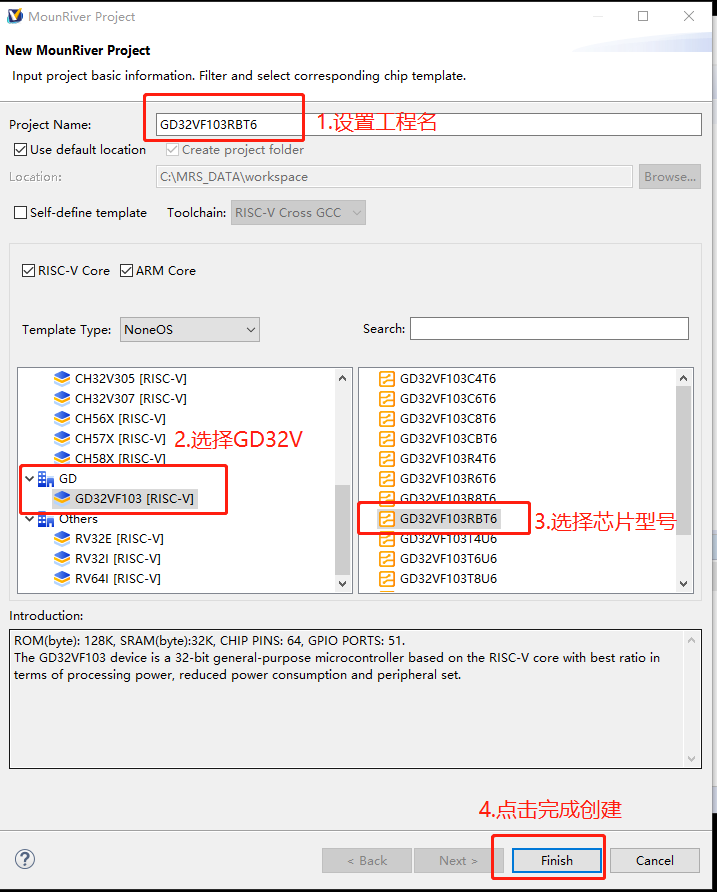

完成后会生成工程，如图所示：

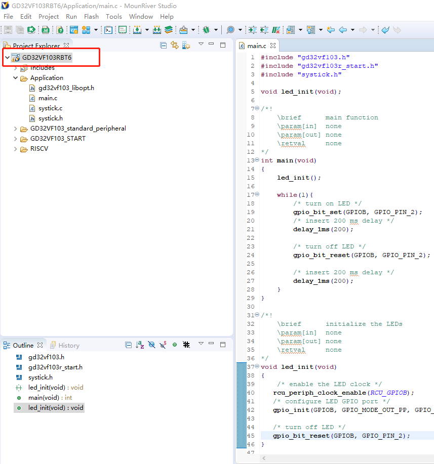

### 2.3 编译下载调试GD32V工程

MRS IDE导入的是默认的LED闪灯程序，由于我们开发板EVB LX的LED灯跟兆易创新官方评估板的GPIO不一样，使用的GPIOB，Pin2，这里我们修改下main.c中的led初始化代码。
将如下代码复制替换main.c文件中的全部代码：

```
#include "gd32vf103.h"
#include "gd32vf103r_start.h"
#include "systick.h"

void led_init(void);

/*!
    \brief      main function
    \param[in]  none
    \param[out] none
    \retval     none
*/
int main(void)
{  
    led_init();
    
    while(1){
        /* turn on LED */
        gpio_bit_set(GPIOB, GPIO_PIN_2);
        /* insert 200 ms delay */
        delay_1ms(200);

        /* turn off LED */
        gpio_bit_reset(GPIOB, GPIO_PIN_2);
        
        /* insert 200 ms delay */
        delay_1ms(200);
    }
}

/*!
    \brief      initialize the LEDs
    \param[in]  none
    \param[out] none
    \retval     none
*/
void led_init(void)
{
    /* enable the LED clock */
   rcu_periph_clock_enable(RCU_GPIOB);
   /* configure LED GPIO port */
   gpio_init(GPIOB, GPIO_MODE_OUT_PP, GPIO_OSPEED_50MHZ, GPIO_PIN_2);

   /* turn off LED */
   gpio_bit_reset(GPIOB, GPIO_PIN_2);
}
```

完成代码拷贝覆盖后，点击如下图所示图标编译工程，编译完成后可以在控制台输出看到编译结果。


如下图所示，点击debug按钮，就可以进入调试模式，程序下载到开发板上，可以打断点、单步、跳步执行，全速执行，查看寄存器，反汇编、内存等


执行全速运行后，可以看到开发板上的用户LED灯间隔闪烁。

除了调试按钮外，我们也可以点击下载按钮直接将程序烧写到开发板上，如下图所示：

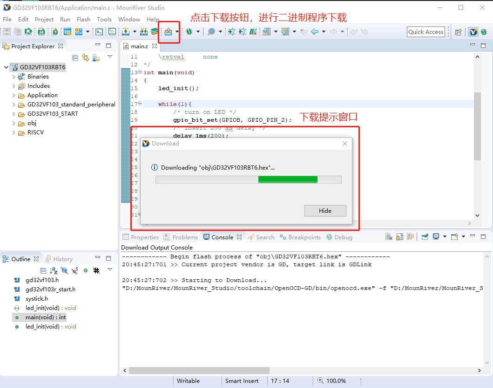

本实验代码下载链接：https://share.weiyun.com/4XXWaOzU 密码：cy4m5f

GD32V-RISC-V物联网操作系统TencentOS-Tiny案例实践指南(20211220)\SourceCode\EVB_LX_GD32V_LED.rar

## 三、TencentOS Tiny内核移植

### 3.1 准备裸机工程
移植TencentOS Tiny内核前，我们先准备一个简单的点灯工程，这里跟前面的步骤一样，我们先使用MounRiver Studio IDE 基于GD32V生成基础工程；
基础的裸机工程包含LED、串口、液晶显示屏驱动。这里我把裸机工程给大家准备好了，大家下载EVB_LX_GD32V_Printf_Lcd.rar 解压后使用IDE打开即可。
裸机工程代码下载链接：https://share.weiyun.com/4XXWaOzU 密码：cy4m5f

GD32V-RISC-V物联网操作系统TencentOS-Tiny案例实践指南(20211220)\SourceCode\EVB_LX_GD32V_Printf_Lcd.rar

### 3.2 准备内核源码
在TencentOS Tiny 官方项目仓下载内核代码，下载地址： https://github.com/Tencent/TencentOS-tiny  

拷贝如下目录的内核代码到新建的TencentOS-Tiny文件夹备用（请严格按照一下目录拷贝，不需要拷贝多余的）

| 一级目录   | 二级目录 | 三级目录 | 四级目录  | 五级目录 | 说明                                                 |
| ---------- | -------- | -------- | --------- | -------- | ---------------------------------------------------- |
| arch       | arm      | risc-v  | common    |          | TencentOS tiny 中断tick相关代码                      |
|            |          |          | rv32i | gcc      | TencentOS Tiny risc-v调度汇编  GCC                      |
|            |          |          | bumblebee | gcc      | GD32V  中断配置相关代码                        |
| kernel     | core     |          |           |          | TencentOS tiny内核源码                               |
|            | hal      |          |           |          | TencentOS tiny驱动抽象层                             |
|            | pm       |          |           |          | TencentOS tiny低功耗源码                             |
| TOS_CONFIG |          |          |           |          | TencentOS tiny配置头文件，用户自定义，从模板修改过来 |


这里只介绍TencentOS tiny的内核移植，所以这里只需要用到 arch、kernel两个目录下的源码。

将全部内核源码复制到工程目录下，如下图：

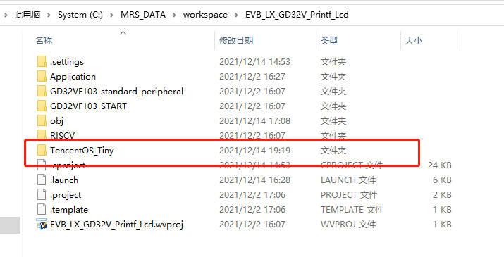

然后我们在工程界面按F5刷新工程，就可以在源码目录看到TencentOS Tiny的内核源码了，如图所示：


### 3.3 添加内核初始化和相关任务代码


1）首先在main.c 中包含内核头文件  #include "tos_k.h"

2）添加Tick处理函数 eclic_mtip_handler

```
void eclic_mtip_handler() {
    port_systick_config((uint32_t)k_cpu_cycle_per_tick);
    if (tos_knl_is_running()) {
        tos_knl_irq_enter();
        tos_tick_handler();
        tos_knl_irq_leave();
    }
}

```

3) 新建两个测试任务

```
#define TASK1_STK_SIZE       1024
k_task_t task1;
uint8_t task1_stk[TASK1_STK_SIZE];


#define TASK2_STK_SIZE       1024
k_task_t task2;
uint8_t task2_stk[TASK2_STK_SIZE];

void task1_entry(void *arg)
{
    int count = 0;
    while (1) {
        printf("###I am task1,count is %d\r\n",count++);
        tos_task_delay(2000);
    }
}

void task2_entry(void *arg)
{
    int count = 0;
    while (1) {
        printf("***I am task2,count is %d\r\n",count++);
        tos_task_delay(1000);
    }
}

```

4） 在main函数中while（1）前面增加操作系统初始化函数


```
    printf("Welcome to TencentOS tiny(%s)\r\n", TOS_VERSION);
    tos_knl_init(); // TencentOS Tiny kernel initialize
    tos_task_create(&task1, "task1", task1_entry, NULL, 4, task1_stk, TASK1_STK_SIZE, 0); // Create task1
    tos_task_create(&task2, "task2", task2_entry, NULL, 3, task2_stk, TASK2_STK_SIZE, 0);// Create task2
    tos_knl_start();


```

5）在工程里面配置TencentOS Tiny 头文件编译目录

如图，需要在IDE里面配置TencentOS Tiny的编译头文件目录，按如图所示配置即可：
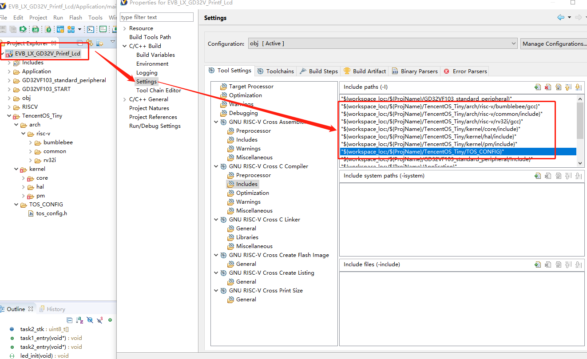

除了增加C编译的头文件，还要增加汇编文件的头文件目录，如下图所示：


6） 修改tos_config.h文件

我们在TencentOS_Tiny文件下新建TOS_CONFIG文件夹，在改文件夹下面新建tos_config.h，代码如下：


```
#ifndef INC_TOS_CONFIG_H_
#define INC_TOS_CONFIG_H_

#include "gd32vf103.h"
#include "stddef.h"


#define TOS_CFG_TASK_PRIO_MAX 10u  // 配置TencentOS tiny默认支持的最大优先级数量


#define TOS_CFG_ROUND_ROBIN_EN 0u  // 配置TencentOS tiny的内核是否开启时间片轮转


#define TOS_CFG_OBJECT_VERIFY 0u   // 配置TencentOS tiny是否校验指针合法

#define TOS_CFG_TASK_DYNAMIC_CREATE_EN  0u  // TencentOS tiny 动态任务创建功能宏


#define TOS_CFG_EVENT_EN 1u   // TencentOS tiny 事件模块功能宏

#define TOS_CFG_MMBLK_EN                1u  //配置TencentOS tiny是否开启内存块管理模块

#define TOS_CFG_MMHEAP_EN 1u  //配置TencentOS tiny是否开启动态内存模块

#define TOS_CFG_MMHEAP_DEFAULT_POOL_EN  1u      // TencentOS tiny 默认动态内存池功能宏

#define TOS_CFG_MMHEAP_DEFAULT_POOL_SIZE 0x1000   // 配置TencentOS tiny默认动态内存池大小


#define TOS_CFG_MUTEX_EN 1u   // 配置TencentOS tiny是否开启互斥锁模块

#define TOS_CFG_MESSAGE_QUEUE_EN        1u      // 配置TencentOS tiny是否开启消息队列模块

#define TOS_CFG_MAIL_QUEUE_EN           1u      // 配置TencentOS tiny是否开启消息邮箱模块

#define TOS_CFG_PRIORITY_MESSAGE_QUEUE_EN   1u  // 配置TencentOS tiny是否开启优先级消息队列模块

#define TOS_CFG_PRIORITY_MAIL_QUEUE_EN  1u      // 配置TencentOS tiny是否开启优先级消息邮箱模块

#define TOS_CFG_TIMER_EN                0u      // 配置TencentOS tiny是否开启软件定时器模块

#define TOS_CFG_PWR_MGR_EN              0u      // 配置TencentOS tiny是否开启外设电源管理模块

#define TOS_CFG_TICKLESS_EN             0u      // 配置Tickless 低功耗模块开关


#define TOS_CFG_SEM_EN 1u  // 配置TencentOS tiny是否开启信号量模块

#define TOS_CFG_TASK_STACK_DRAUGHT_DEPTH_DETACT_EN      0u  // 配置TencentOS tiny是否开启任务栈深度检测

#define TOS_CFG_IDLE_TASK_STK_SIZE      512u    // 配置TencentOS tiny空闲任务栈大小


#define TOS_CFG_CPU_SYSTICK_PRIO 0xF


#define TOS_CFG_IRQ_STK_SIZE 128u


#define TOS_CFG_CPU_TICK_PER_SECOND     1000u   // 配置TencentOS tiny的tick频率

#define TOS_CFG_CPU_CLOCK               (SystemCoreClock)   // 配置TencentOS tiny CPU频率


#define TOS_CFG_TIMER_AS_PROC 1u  // 配置是否将TIMER配置成函数模式


#endif /* INC_TOS_CONFIG_H_ */


```

7）编译下载测试

编译完成下载到开发板，通过串口助手我们可以看到两个任务交替运行，打印task信息，说明内核移植成功，如下图所示：

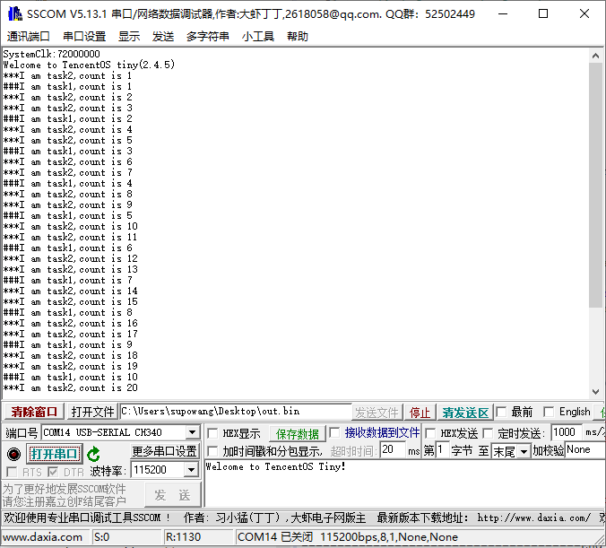

本实验代码下载链接：https://share.weiyun.com/4XXWaOzU 密码：cy4m5f

GD32V-RISC-V物联网操作系统TencentOS-Tiny案例实践指南(20211220)\SourceCode\EVB_LX_GD32V_TencentOS_Tiny.rar


##  四、 基于TencentOS Tiny 和E53_SC1模块采集光照强度实验

1） E53_SC1 扩展模块介绍
E53_SC1扩展模块包含一个BH1750 传感器和一个高亮LED灯，功能示意图如下：

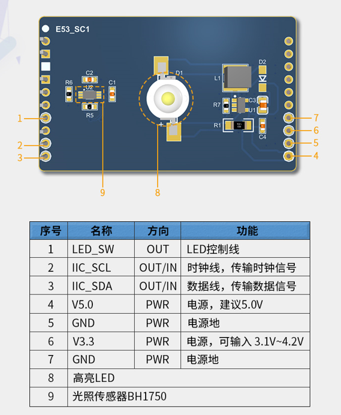

将模块插到开发板的E53接口即可

2） 编写BH1750驱动
BH1750FIV是一个采用标准IIC总线接口的环境光强传感器，共有六种工作模式，分为连续型和一次型，连续型又分为高精度1、2和低精度模式，单次型同样分为高精度1、2和低精度模式。单次型与连续型的区别在于单次型读完一次数据就会自动转为PowerDown模式。
比如一次型低分辨率模式的时序图如下图所示：


根据时序，编写的核心驱动程序如下，对BH1750 传感器进行初始化、启动测量，等待测量结果，读取测量值。


```

void Init_BH1750(void)
{
    uint8_t t_Data = 0x01;
    /* configure GPIO */
    gpio_config();
    /* configure I2C */
    i2c_config();

    BH1750_I2C_Master_Transmit(BH1750_Addr,&t_Data,1);
}


void Start_BH1750(void)
{
    uint8_t t_Data = 0x10;
    BH1750_I2C_Master_Transmit(BH1750_Addr,&t_Data,1);
}


void Init_E53_SC1(void)
{
	Init_Light();
	Init_BH1750();
}

void E53_SC1_Read_Data(void)
{
	
	Start_BH1750();
	delay_ms(180);
	BH1750_I2C_Master_Receive(BH1750_Addr+1,BUF,2); 
	result=BUF[0];
	result=(result<<8)+BUF[1];
	E53_SC1_Data.Lux=(float)(result/1.2);
    
}


```

3）基于上个章节移植好的TencentOS Tiny工程，在其中一个任务1中添加E53_SC1初始化，获取光照强度，打印在串口，并显示在液晶屏OLED上

详细代码如下：


```
void task1_entry(void *arg)
{
    int count = 1;
    Init_E53_SC1();
    E53_SC1_LED_StatusSet(OFF);
    while (1) {
        printf("###I am task1,count is %d\r\n",count++);
        if (count/10==1)
        {
            E53_SC1_LED_StatusSet(ON);// Open E53 led
        }
        else if (count/10==6) {
            E53_SC1_LED_StatusSet(OFF);// Open E53 led
        }
        E53_SC1_Read_Data();
        printf("\r\n********E53_SC1_BH1750 Value is  %d\r\n",(int)E53_SC1_Data.Lux);
        memset(payload, 0, sizeof(payload));
        snprintf(payload,sizeof(payload),"%d   ",(int)E53_SC1_Data.Lux);
        OLED_ShowString(48, 3, (uint8_t*)payload, 8);

        tos_task_delay(100);
    }
}

```

编译完成，可以在开发板上看到液晶屏实时显示了光照强度值，单位LUX；


同时串口会打印相应的logo，如下图：

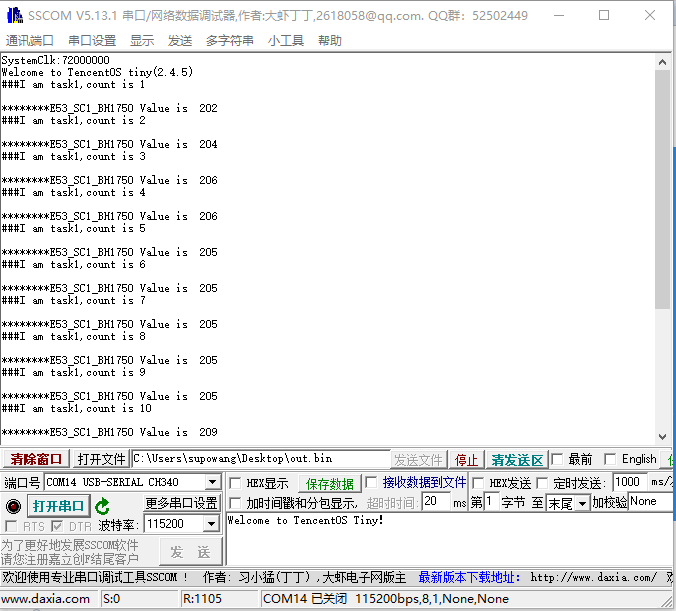


本实验代码下载链接：https://share.weiyun.com/4XXWaOzU 密码：cy4m5f

GD32V-RISC-V物联网操作系统TencentOS-Tiny案例实践指南(20211220)\SourceCode\EVB_LX_GD32V_TencentOS_Tiny_BH1750.rar

##  五、基于TencentOS Tiny 将 BH1750传感器采集的光照强度数据上传到腾讯云物联网平台和腾讯连连小程序


基于TencentOS Tiny EVB LX RISC-V开发板要完成腾讯云IoT Explorer对接，需要完成两个部分的工作。 
一是：腾讯云IoT explorer 上完成项目、产品、设备创建、参数配置 
二是：基于TencentOS Tiny完成应用开发，向腾讯云上报业务数据。


### 1. 云端操作步骤
1.1. 新建项目
登录[腾讯云物联网开发平台](https://cloud.tencent.com/product/iotexplorer)，点击新建项目，填写项目名称和简介：

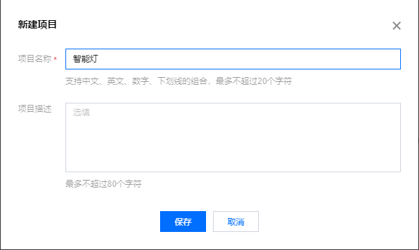

1.2. 新建产品
点击项目名称进入到该项目中，点击新建产品：

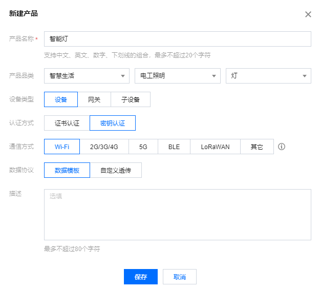

产品新建成功后，可在产品列表页查看到：


1.3. 数据模板
进入产品，点击【数据模板】，点击【导入JSON】，导入下面的JSON代码：
```json
{
  "version": "1.0",
  "properties": [
    {
      "id": "power_switch",
      "name": "电灯开关",
      "desc": "控制电灯开灭",
      "required": true,
      "mode": "rw",
      "define": {
        "type": "bool",
        "mapping": {
          "0": "关",
          "1": "开"
        }
      }
    },
    {
      "id": "brightness",
      "name": "光照强度",
      "desc": "",
      "mode": "r",
      "define": {
        "type": "int",
        "min": "0",
        "max": "20000",
        "start": "0",
        "step": "1",
        "unit": "lx"
      },
      "required": false
    }
  ],
  "events": [],
  "actions": [],
  "profile": {
    "ProductId": "TCC64FUFGD",
    "CategoryId": "3"
  }
}
```

导入之后自动根据json文件创建的属性如下：

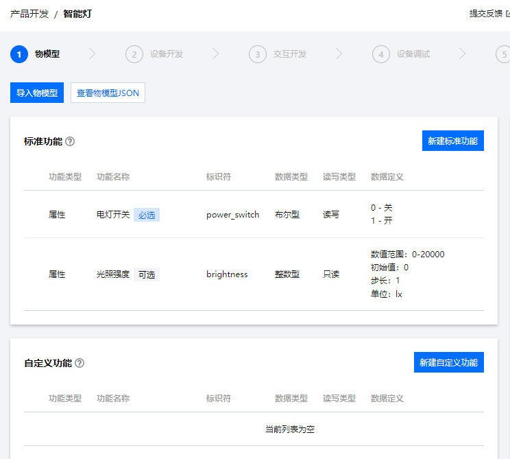

1.4. 创建设备
点击【设备调试】，进入后点击【新建设备】，创建真实设备：

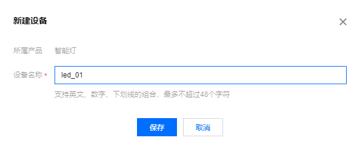

创建成功之后进入设备，查看到产品ID、设备名称、设备秘钥,记录下来，一会终端程序会使用到。


### 2. 基于TencentOS Tiny 完成设备侧应用开发

本实验代码下载链接：https://share.weiyun.com/4XXWaOzU 密码：cy4m5f

GD32V-RISC-V物联网操作系统TencentOS-Tiny案例实践指南(20211220)\SourceCode\EVB_LX_GD32V_TencentOS_Tiny_IoT_Explorer.rar

进入 < EVB_LX_GD32V_TencentOS_Tiny_IoT_Explorer> 目录，打开EVB_LX_GD32V_TencentOS_Tiny_IoT_Explorer工程。


2.1. 修改WIFI接入信息
打开`main.c`文件编辑，在application_entry函数中修改要接入WIFI的名称和密码（建议使用手机热点，不要有特殊字符）：

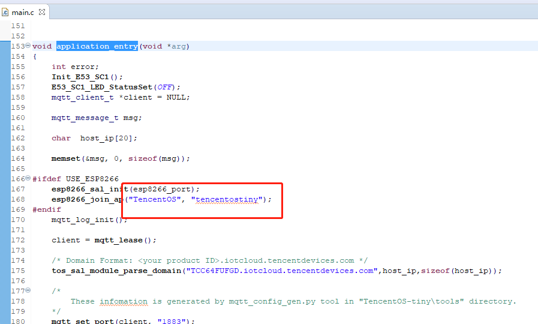

2.2. 修改云端对接信息
终端的MQTT客户端需要对应的产品ID、设备ID，密码，我们使用前面从云端获取到的产品ID、设备名称、设备密钥，然后利用如下的python脚本来生成mqtt 用户名 密码等信息：

python脚本如下，也可以到https://github.com/OpenAtomFoundation/TencentOS-tiny/blob/master/tools/mqtt_config_gen.py  获取。

```
#!/usr/bin/python
# -*- coding: UTF-8 -*-

import base64
import hashlib
import hmac
import random
import string
import time
from string import Template

# bind raw_input to input in Python 2
try:
    input = raw_input
except NameError:
    pass

product_id = input("product id:")
dev_name = input("device name:")
passwd = input("password:")
sub = input("subscribe topic:[default:control]")
if sub == "":
    sub = "control"
pub = input("publish topic:[default:event]")
if pub == "":
    pub = "event"

client_id = product_id + dev_name
# expire time: 2^32 - 1 = 4294967295
username = client_id+";21010406;12365;{}".format(4294967295)

def hmacsha1(content, passwd):
        passwd_byte = base64.b64decode(passwd)
        return hmac.new(passwd_byte, content, digestmod=hashlib.sha1).hexdigest()

username = username.encode("utf-8")
passwd = passwd.encode("utf-8")
sign = hmacsha1(username, passwd)

template = ('#ifndef  TOS_MQTT_CONFIG_H\n'
            '#define  TOS_MQTT_CONFIG_H\n'
            '\n'
            '#define MQTT_SERVER_IP          "111.230.189.156"\n'
            '#define MQTT_SERVER_PORT        "1883"\n'
            '#define MQTT_PRODUCT_ID         "$product"\n'
            '#define MQTT_DEV_NAME           "$dev"\n'
            '#define MQTT_CLIENT_ID          "$product$dev"\n'
            '#define MQTT_USR_NAME           "$product$dev;21010406;12365;4294967295"\n'
            '#define MQTT_PASSWORD           "$sign;hmacsha1"\n'
            '#define MQTT_SUBSCRIBE_TOPIC    "$product/$dev/$sub"\n'
            '#define MQTT_PUBLISH_TOPIC      "$product/$dev/$pub"\n'
            '\n'
            '#endif\n'
            '\n')

src = Template(template)

d = {
        'product':product_id,
        'dev':dev_name,
        'sign':sign,
        'sub':sub,
        'pub':pub
    }

#do the substitution
dst = src.substitute(d)
print("===============Generate mqtt_config.h==================")
print(dst)
with open('mqtt_config.h', 'w') as f:
    f.write(dst)


```

运行python脚本，一次输入产品ID、设备名称、设备密钥，就可以生成对用的mqtt信息了，如下图所示：


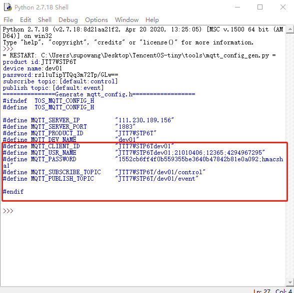


同样在main.c文件内，修改云端配置信息，使用上面脚本生成的信息替换：

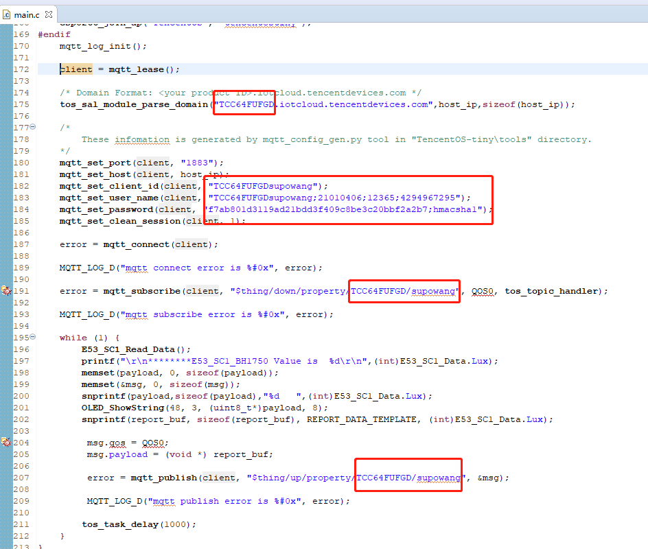


2.3. 编译工程
点击编译按钮，编译整个工程并将程序下载到开发板，由于GD-Link的设计问题，这里下载到RISC-V开发板会非常慢，大家耐心等待一下。
下载完成，打开热点，复位开发板，我们可以看到终端输出相关log，如下图：


### 3. 云端平台查看设备数据
回到腾讯云物联网开发平台，可以看到设备状态变为【在线】：


点击【设备日志】一栏，可以看到设备上报的光照强度：


点击【在线调试】一栏，修改属性【期望值】后点击【发送】，可以对灯泡进行远程控制。

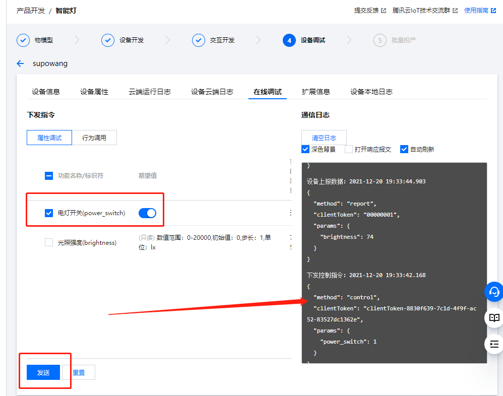

### 4、腾讯连连小程序操作步骤
1. 添加家庭
手机端在【微信】搜索【腾讯连连】小程序，首次使用需要进入后点击【我的】->【家庭管理】，添加一个你喜欢的名称即可。

2. 添加调试设备
返回【首页】，点击右上角“加号”图标：


进入后点击右上角扫码图标：


在腾讯云物联网开发平台进入【设备调试】，点击对应设备后的【二维码】：


腾讯连连扫描此二维码即可成功添加设备，添加成功之后如图：

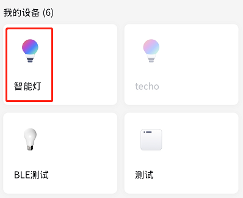

点击此设备即可实时查看数据，并下发控制指令：


3. 修改腾讯连连显示面板
进入【交互开发】，点击【面板配置】一栏：


在此页面中可以自己根据喜好配置小程序显示面板,保存之后，在腾讯连连小程序删除设备，重新扫描绑定设备即可生效。


